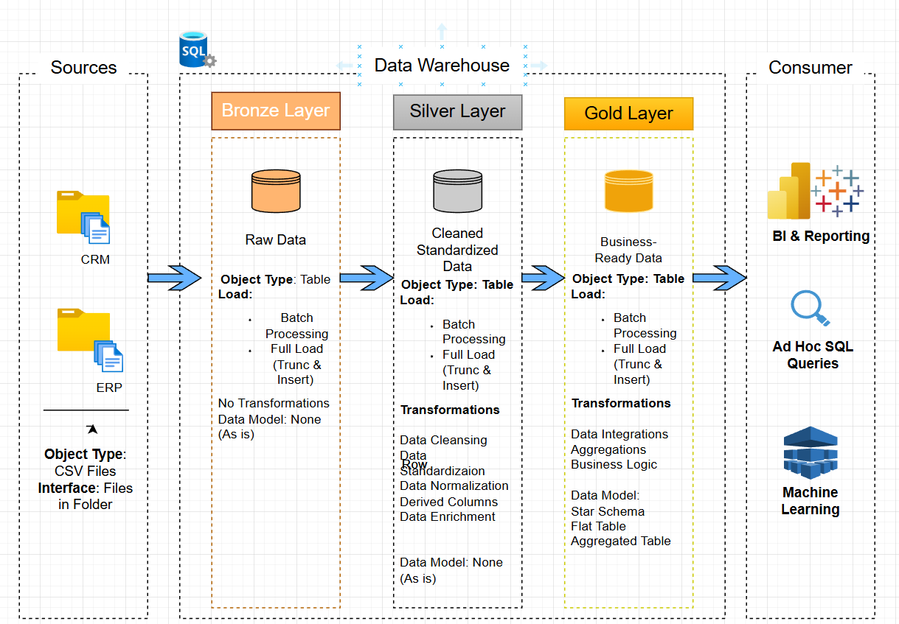

# 🏗️ Data Warehouse Project (Medallion Architecture)

---

## 📌 Project Overview

This project demonstrates the design and implementation of a modern data warehouse using **Medallion Architecture (Bronze, Silver, Gold layers)**.

It consolidates ERP and CRM data into a structured model for analytics and reporting.

Key focus areas:
- Data Engineering
- ETL Pipelines
- Data Modeling
- SQL Analytics

---

## 🚀 Project Requirements

### Data Engineering Objective
Build a data warehouse using SQL Server to consolidate sales data for reporting and analysis.

### Specifications:
- Data Sources: ERP & CRM CSV files
- Data Cleaning: Remove inconsistencies and errors
- Integration: Unified analytical data model
- Scope: Latest dataset only (no historization)
- Documentation: Clear data model for stakeholders

## 🏗️ DataWareHouse Architecture Overview

This project follows a **modern layered data architecture** designed to transform raw data into analytics-ready insights.  
The architecture is structured into three main layers: **Bronze, Silver, and Gold**.

---

### 📊 Architecture Diagram
> The diagram below illustrates the flow of data across layers.


 
    
# 📊 Data Warehouse Project

## 📌 Project Overview

This project demonstrates the design and implementation of a modern data warehouse using a layered architecture (**Bronze → Silver → Gold**).

The goal is to transform raw data into a structured, analytics-ready format that supports reporting and business insights.

---

## 🏗️ Data Architecture


*Figure: End-to-end data flow from Bronze → Silver → Gold layer*

### 🔄 Data Flow

```text
Source Systems → Bronze → Silver → Gold → Analytics / BI
```

* **Bronze Layer** → Raw data ingestion
* **Silver Layer** → Cleaned and transformed data
* **Gold Layer** → Business-ready star schema

---

### 🥉 Bronze Layer (Raw Data)

* Stores raw data as received from source systems
* Minimal transformations applied
* Serves as a historical data source

---

### 🥈 Silver Layer (Cleaned Data)

* Data is cleaned and standardized
* Handles missing values and duplicates
* Prepares data for modeling

---

### 🥇 Gold Layer (Business Model)

The Gold layer is designed using a **star schema** for analytical querying.

**Tables:**

* `fact_sales`
* `dim_customers`
* `dim_products`

**Features:**

* Optimized for performance
* Simplified joins
* Business-friendly structure

---

## ⭐ Star Schema Design


*Figure: Star schema model for sales analytics*

The star schema consists of:

* A central **fact table** (`fact_sales`)
* Connected **dimension tables** (`dim_customers`, `dim_products`)

---

## 📚 Data Catalog

Detailed descriptions of tables and columns in the Gold layer:

👉 [View Data Catalog](docs/data_catalog.md)

---

## 🛠️ Technologies Used

* SQL (T-SQL)
* SQL Server
* Git & GitHub
* draw.io (diagrams)

---

## 📂 Repository Structure

```text
.
├── docs/
│   ├── data_architecture.png
│   ├── star_schema.png
│   └── data_catalog.md
│
├── sql/
│   └── gold_layer_views.sql
│
└── README.md
```

---

## 🚀 Key Highlights

* Layered data architecture (Bronze → Silver → Gold)
* Star schema data modeling
* Clean and scalable design
* Analytics-ready data structures

---

## 📈 Future Improvements

* Add date dimension
* Implement incremental loading
* Connect to BI dashboard (Power BI / Tableau)

---


## 🔄 Data Flow

```text
Source Systems → Bronze → Silver → Gold → BI / Analytics

```text
Source Systems → Bronze → Silver → Gold → BI / Analytics

---

## 📁 Repository Structure

```text
data-warehouse-project/
│
├── datasets/              # Raw ERP & CRM data
├── docs/                  # Architecture & documentation
│   ├── etl.drawio
│   ├── data_architecture.drawio
│   ├── data_flow.drawio
│   ├── data_models.drawio
│   ├── data_catalog.md
│   └── naming-conventions.md
│
├── scripts/              # SQL scripts
│   ├── bronze/
│   ├── silver/
│   └── gold/
│
├── tests/                # Data validation scripts
├── README.md
├── LICENSE
├── .gitignore
└── requirements.txt


```
## 
🛡️ License

This project is licensed under the MIT License.

You are free to use, modify, and share this project with proper attribution.

🌟 About Me

Hi there! I'm Caren Chepng'eno Rutto (Kareena) 👋

I am an aspiring Data Analyst / Data Engineer passionate about building real-world data projects that turn raw data into meaningful insights.

I enjoy:

SQL & data analysis
Data engineering & pipelines
Building portfolio projects
Learning analytics tools and technologies

This project represents my journey into modern data engineering and analytics.
Social Media 
www.linkedin.com/in/caren-rutto-21899751

